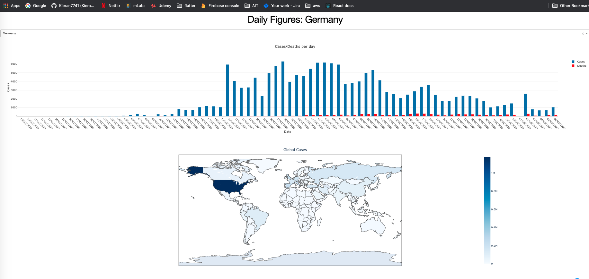

# Covid 19 Dashboard

Dashboard built using [Dash](https://plotly.com/dash/), a Python framework for building interactive dashboards.


### Launch Dashboard

* First install all requirements

```commandline
# Optionally create a virtual enviornment 
python3.7 -m venv .env
source .env/bin/activate

# Required: Install all required modules
pip install -r requirements.txt
```

* Run the Dashboard
```commandline
# Launch dashboard on localhost:8050
python app.py
```


